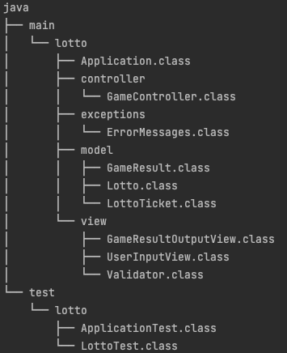

# 미션 - 로또 게임 🍀

## ✅ 기능 목록

### 1. 게임 시작

- [X] 로또 구입 금액을 입력 받는다.
  - [X] 구입 금액은 1,000원 단위로 입력 받는다.
  - [X] 입력 단위가 1,000원으로 나누어 떨어지지 않는 경우 예외 처리한다.
  - [X] 잘못된 값을 입력한 경우 예외 처리한다.

### 2. 게임 진행

- [X] 로또 게임을 시작한다.
  - [X] 로또 번호의 숫자 범위는 1~45까지이다.
  - [X] 1개의 로또를 발행할 때 중복되지 않는 6개의 숫자를 뽑는다.

- [X] 발행한 로또 수량 및 번호를 출력한다.
  - [X] 로또 번호는 오름차순으로 정렬하여 보여준다.

- [X] 당첨 번호를 입력 받는다.
  - [X] 당첨 번호를 입력 받는데 쉼표(`,`)를 기준으로 구분한다.
  - [ ] 당첨 번호 추첨 시 중복되지 않는 숫자 6개와 보너스 번호 1개를 뽑는다.
  - [X] 잘못된 값을 입력한 경우 예외 처리한다.

- [X] 보너스 번호를 입력 받는다.
  - [X] 잘못된 값을 입력한 경우 예외 처리한다.

### 3. 게임 종료

- [X] 게임 종료 후 당첨 통계를 출력한다.

- [X] 총 수익률을 출력한다.
  - [X] 수익률은 소수점 둘째 자리에서 반올림한다. (ex. 100.0%, 51.5%, 1,000,000.0%)

### 4. 예외

- 사용자가 잘못된 값을 입력할 경우 `IllegalArgumentException`를 발생시키고, "[ERROR]"로 시작하는 에러 메시지를 출력 후 **그 부분부터 입력을 다시 받는다.**
  - `Exception`이 아닌 `IllegalArgumentException`, `IllegalStateException` 등과 같은 명확한 유형을 처리한다.
  - 예외 상황 시 에러 문구를 출력해야 한다. 단, 에러 문구는 "[ERROR]"로 시작해야 한다.
    (ex. [ERROR] 로또 번호는 1부터 45 사이의 숫자여야 합니다.)

### 5. 목표

- 요구 사항을 자세히 읽고 구현한다.
- 클래스(객체)를 분리한다.
- 도메인 로직에 대한 단위 테스트를 작성한다.
- 객체지향적으로 설계한다.

### 6. 2주 차 미션(자동차 경주 게임 🏁) 코드 리뷰를 통해 개선할 점

- 지난 미션에서 개선할 필요가 있는 리뷰를 정리하여 이번 미션에서 개선하고자 했습니다.
- 아래 테이블 형식은 <b>@h-beeen</b>님의 README를 참고했습니다.

<table>
    <tr>
        <th align="center">Type</th>
        <th align="center">Review</th>
        <th align="center">Reviewer</th>
    </tr>
    <tr><td colspan="3"></td></tr>
    <tr>
        <td rowspan="1"><b>📖&nbsp;README</b></td>
        <td>01. 예외 처리를 하는 조건에 대해 README에 자세히 적으면 좋겠다.</td>
        <td><b>@SSung023</b></td>
    </tr>
    <tr><td colspan="3"></td></tr>
    <tr>
        <td rowspan="15"><b>✏️&nbsp;코드 리뷰</b></td>
        <td>01. 확장성을 고려해보고 구현해보자.</td>
        <td><b>@SSung023</b></td>
    </tr>
      <tr>
        <td>02. 객체가 많은 역할을 담당하지 않도록 분리해보자.</td>
        <td><b>@ChoiWonYu @youmikimm @gywns0417</b></td>
    </tr>
      <tr>
        <td>03. 에러 메시지 같은 경우에는 Enum 클래스로 분리해서 관리해보자.</td>
        <td><b>@ChoiWonYu</b></td>
    </tr>
      <tr>
        <td>04. 배열보다 List를 활용하자.</td>
        <td><b>@ChoiWonYu</b></td>
    </tr>
      <tr>
        <td>05. 입력과 출력을 관리하는 부분을 나누어 보자.</td>
        <td><b>@Big-Cir97 @Jihyun3478 @JWbase</b></td>
    </tr>
      <tr>
        <td>06. 매직 넘버보단 상수를 이용하자.</td>
        <td><b>@ChoiWonYu</b></td>
    </tr>
      <tr>
        <td>07. depth를 줄여 가독성을 높여보자.</td>
        <td><b>@Big-Cir97</b></td>
    </tr>
    <tr>
        <td>08. 메서드 내에서 예외처리를 할 수 있다면 바로 해보자.</td>
        <td><b>@YejiGong</b></td>
    </tr>
    <tr>
        <td>09. while문과 for문을 사용하는 상황이 다르기 때문에 적절하게 사용하자.</td>
        <td><b>@ChoBeomHee</b></td>
    </tr>
    <tr>
        <td>10. 모든 메서드에 대해 테스트 코드를 작성하는 것이 아니기 때문에, 자명한 부분에 대해서는 테스트 코드를 위해 메서드를 추가하지 말자.</td>
        <td><b>@YejiGong</b></td>
    </tr>
</table>

### 7. 패키지 구조

